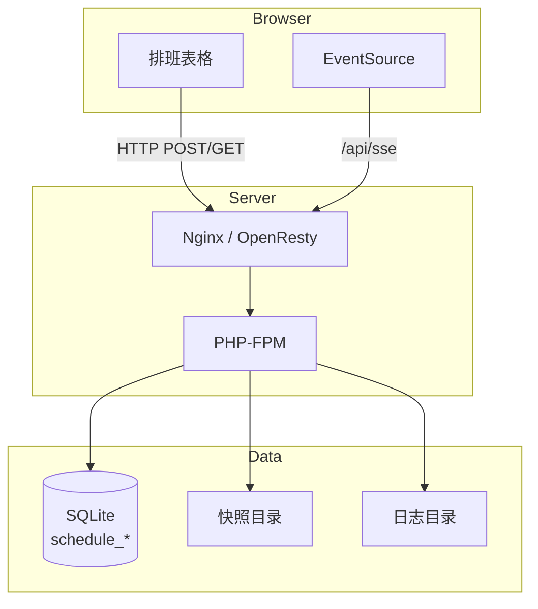

# 排班协作平台 v0.1.0

## 项目概览
排班协作平台基于 OpenResty + PHP-FPM + SQLite 的轻量级栈实现，采用“HTTP 写入 + SSE 推送”方案 A，保障多用户同时排班时的无冲突、无异常与强实时体验。后端通过 CAS + 幂等操作日志控制写入，前端则以 EventSource 保持与服务器的实时联动，并提供软锁提示，确保每位成员的修改都可追踪、可回滚。

### 核心特性
- **强一致写入**：`schedule_cells` 表使用版本号实现 CAS，结合 `op_id` 幂等去重，消除并发冲突。
- **实时同步**：SSE 增量推送 `cell.update` 事件，断线重连会自动补齐缺失操作。
- **软锁防踩踏**：`schedule_softlocks` 记录编辑占用情况，灰度提醒潜在冲突。
- **每日快照**：`schedule_snapshots` 保留历史状态，支持一键恢复与定时任务。
- **前端无跳动下拉**：修复班次下拉弹回顶部的问题，保障滚动位置稳定。

### 架构示意


## 目录结构
```
api/               # PHP 接口脚本（含公共库）
config/            # 应用配置与 Nginx 片段
public/            # 前端静态页面与脚本
schema/            # SQLite 初始化脚本
bin/               # 安装与快照脚本
docs/              # 项目文档
```

## 快速开始（本地 / 1Panel 容器）
1. **安装依赖**：确保容器内已有 PHP 8.x、SQLite3、OpenResty。
2. **初始化数据库**：
   ```bash
   ./bin/install.sh
   ```
   生成 `data/schedule.db` 与默认配置 `config/app.php`。
3. **调整配置**：按照实际部署路径编辑 `config/app.php`，确认数据库、班次列表、日志/快照目录。
4. **启动服务**：使用 OpenResty/Nginx 指向 `public/` 目录，PHP-FPM 负责解析 `/api/*.php`。
5. **体验功能**：浏览器访问 `https://${DOMAIN}/public/index.html`（或站点根），使用页面顶部的团队、日期切换排班，感受 SSE 实时同步效果。

## 运维提示
- `log/ops.log` 记录所有成功操作的关键信息，建议配合日志采集体系。
- `snapshots/` 存储快照 JSON，可通过 `/api/snapshot.php?mode=list` 查询。
- 若需扩展班次，只需同时修改 `config/app.php` 与 `schema/init.sql` 中的检查约束。
- 定期执行 `bin/daily_snapshot.sh` 以保存每日状态，详见部署文档的计划任务章节。

## 已知问题与修复
- ✅ **已修复**：排班页单元格右侧下拉按钮会触发页面回到顶部。现统一改用 `button` 触发器、固定定位弹层，并加入键盘可达性与滚动保持策略，确保长表格滚动位置稳定。
