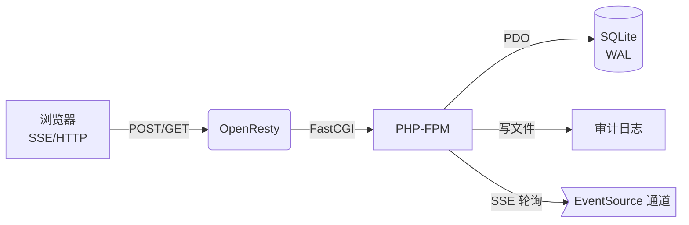

# 协同排班系统 v0.1.0

## 项目概览
- **架构**：OpenResty (Nginx) 反向代理 + PHP-FPM + SQLite（WAL）
- **协作模型**：HTTP 写入 + SSE(Server-Sent Events) 推送增量，客户端断线后通过 `sync_ops` 补差
- **一致性策略**：CAS（版本比较）+ 幂等 `op_id`，写操作全量审计、软锁提示、每日快照可回滚
- **运行环境**：1Panel 托管的 HTTPS 站点（${DOMAIN}），PHP 8.x，SQLite 3



## 核心特性
1. **无冲突写入**：`update_cell` 使用版本号 + `op_id` 幂等保障，并发写入自动检测冲突
2. **无异常保障**：软锁提醒、输入白名单、事务化写入、频率限制、每日快照辅助审计
3. **强实时**：SSE 长连接推送最新单元格变更，断线自动调用 `sync_ops` 补齐增量
4. **前端易用性**：下拉班次浮层采用 `position: fixed`，不会再触发滚动回顶，支持键盘/鼠标操作

## 目录结构
```
api/             # PHP 接口（写入、查询、SSE、快照、软锁）
config/          # 示例配置、Nginx SSE 片段
public/          # 前端页面与脚本
schema/          # SQLite 初始化脚本
bin/             # 安装脚本、每日快照任务
docs/            # 文档（本文件、API、部署、变更等）
```

## 快速开始（最小可跑）
1. **准备环境**：确保服务器已安装 OpenResty+PHP8，并通过 1Panel 管理
2. **拷贝代码**：将仓库上传至 `${SITE_ROOT}`，保持目录结构
3. **初始化数据库**：执行 `bash ${SITE_ROOT}/bin/install.sh`（会自动复制配置与建库）
4. **配置 Nginx**：在 1Panel 中将 `/config/nginx.sse.conf` 内容粘入站点 `server {}`，重载 Nginx
5. **访问页面**：浏览器打开 `https://${DOMAIN}`，使用页面右上角按钮加载当天排班并开始协作

> 首次登录可通过浏览器开发者工具手动设置 `X-USER-ID` 头部模拟不同用户（真实环境请替换为实际 SSO）

## 实时协作流程
1. 用户点击单元格右侧按钮 → 前端调用 `lock.php?action=acquire`
2. 选择班次 → `update_cell.php` 写入（CAS 校验）
3. PHP 事务提交后写入 `schedule_ops` → SSE 通道轮询增量并推送
4. 其他客户端收到事件 → 更新本地 UI 与版本 → 若冲突则自动重拉
5. 每日 00:05 运行 `bin/daily_snapshot.sh` → `schedule_snapshots` 记录历史版本

## 已知问题与修复
详见 [`docs/CHANGELOG.md`](./CHANGELOG.md) 与下方“已知问题与修复”章节。

### 已知问题与修复
- ✅ **单元格下拉导致页面回顶**：已改为按钮触发 + `position: fixed` 浮层，禁止默认锚点行为，同时确保展开/关闭不改变滚动位置，并支持键盘 Esc/外部点击关闭。

## 进一步规划
- 对接真实用户体系（SSO / Token）并替换鉴权桩
- 扩展班次集合与团队成员配置接口
- SSE 通道可考虑改为基于消息队列的推送以降低轮询频率
